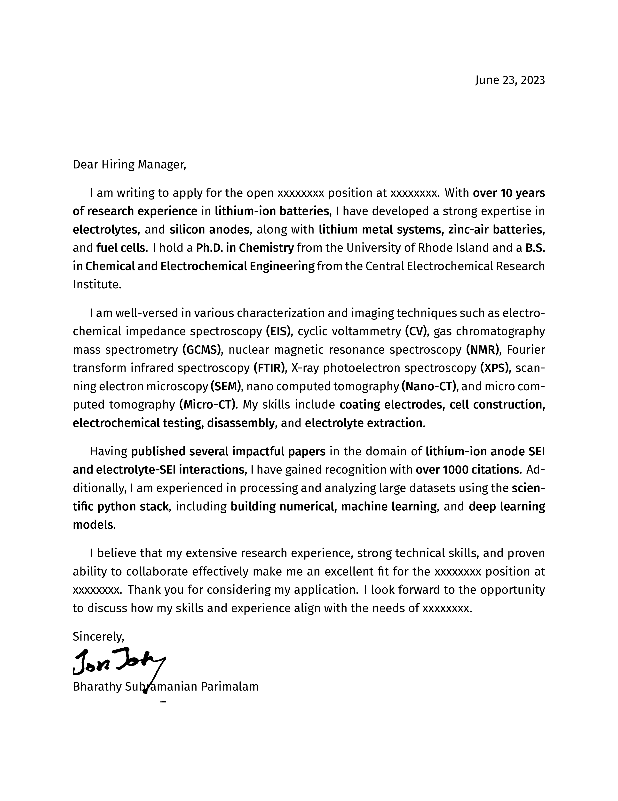
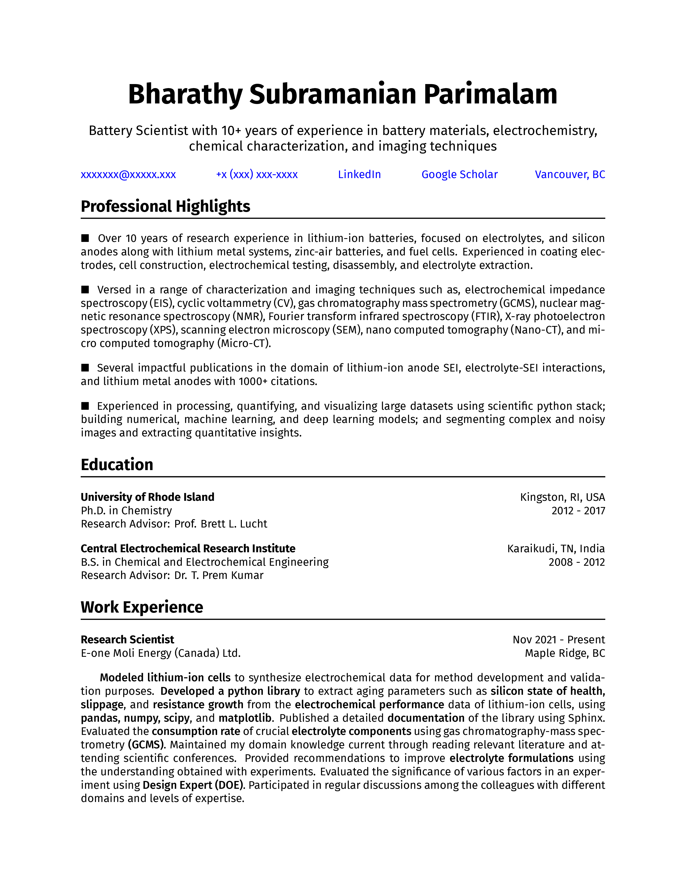
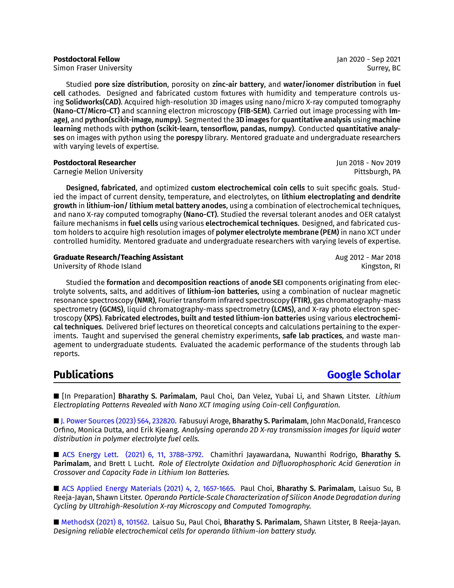
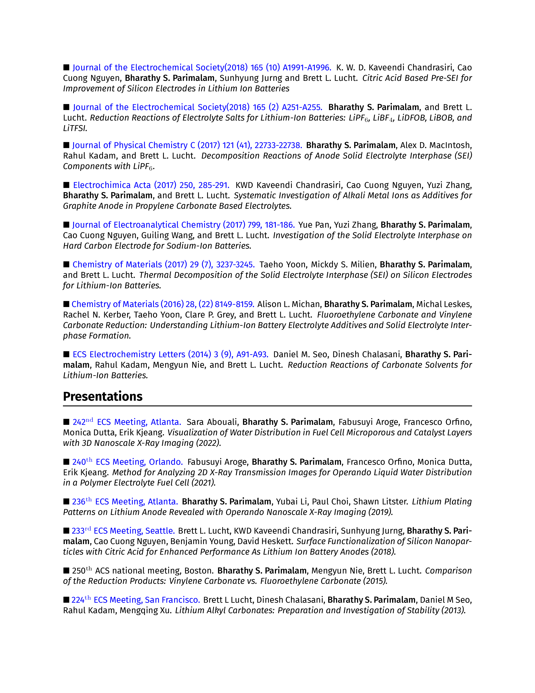
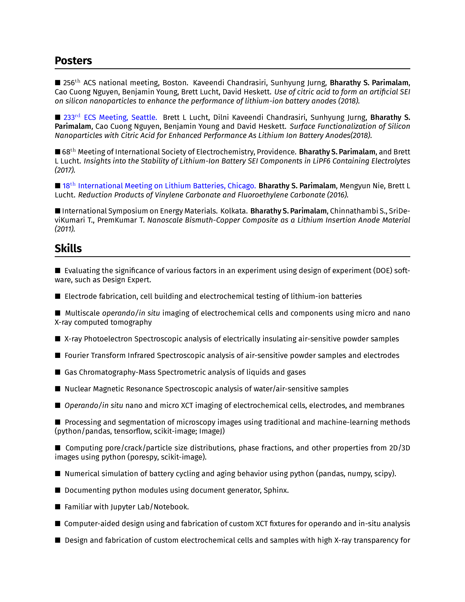

Research Scientist CV and CV Page 1 in LaTeX
################################################

This is a simple CV Page 1 and CV LaTeX template for research scientists.

+-------------------+---------------------------------------------------+
|   File            |   Description                                     |
+===================+===================================================+
|   main.tex        |   the main document with the content, and style   |
+-------------------+---------------------------------------------------+
|   main.dep        |   lists all the dependencies                      |
+-------------------+---------------------------------------------------+
|   signature.png   |   signature file                                  |
+-------------------+---------------------------------------------------+
|   main.pdf        |   output file, CV Page 1 and the resume        |
+-------------------+---------------------------------------------------+

Instructions
**************

- Install MikTeX from here https://miktex.org/
- Open the main.tex using the built-in editor
- Edit the content in the main.tex file
- Replace signature.png file with your signature
- Build using the LuaLaTeX option
- Done!

Output Preview
**************

